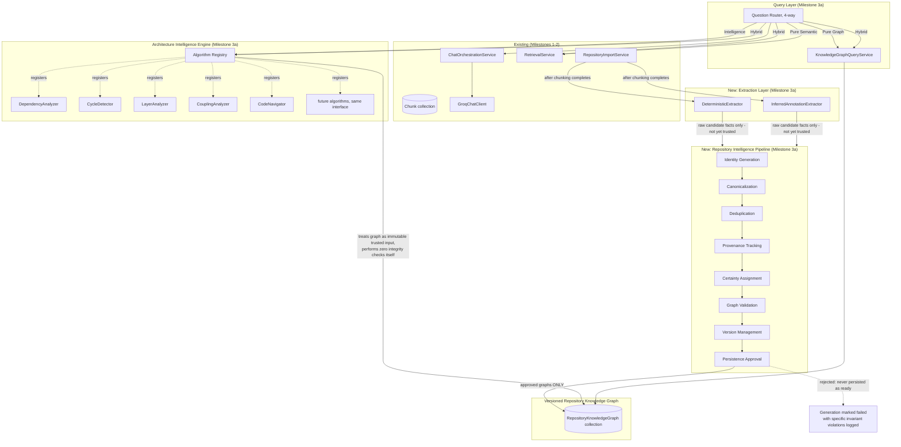
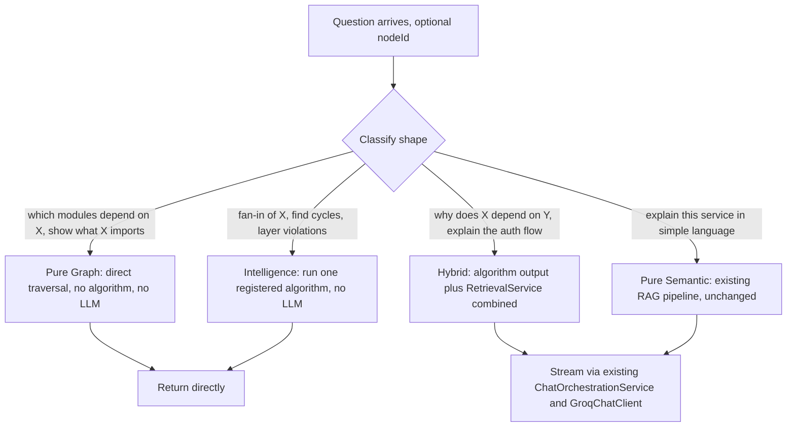
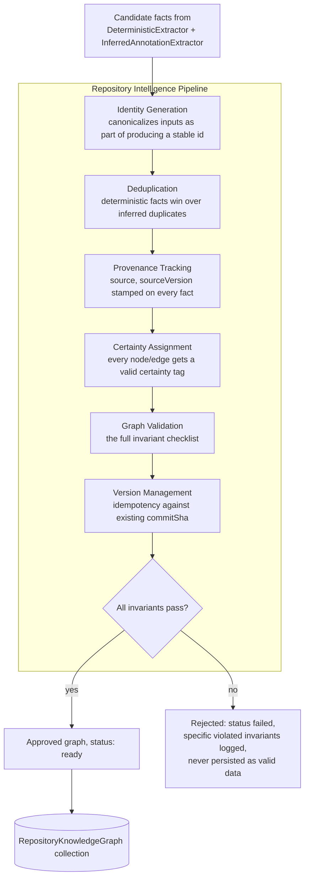
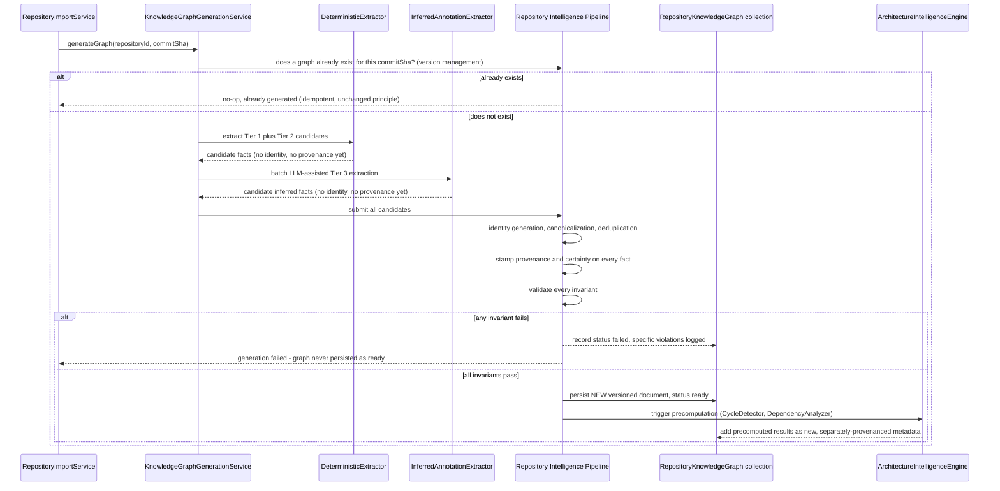
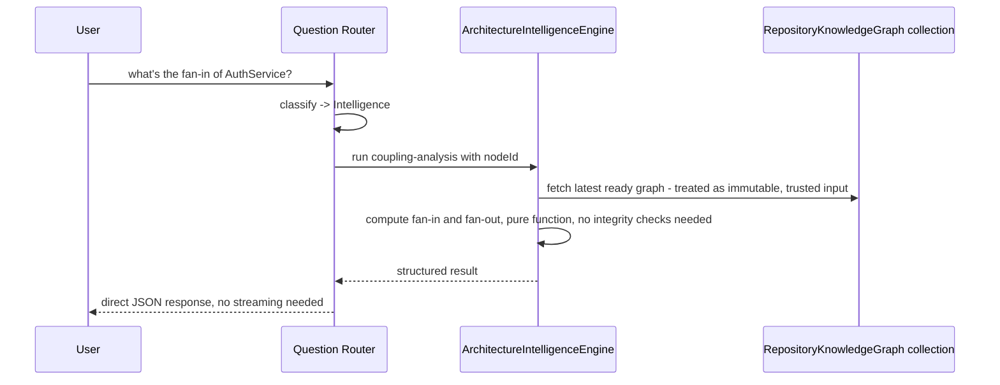
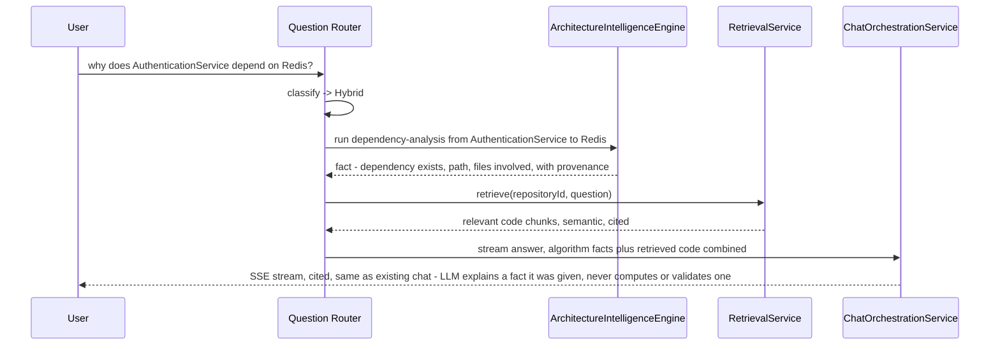
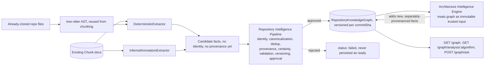

# Milestone 3 Design — Repository Knowledge Graph & Architecture Intelligence Engine

**This is the final architectural refinement before implementation. After this document, the architecture is frozen.** Every decision made across all prior design passes is preserved and named explicitly below, not silently inherited: question routing by shape, the deterministic-vs-inferred distinction (now formalized as certainty within full provenance metadata), reuse of the existing RAG pipeline and streaming infrastructure, idempotent and versioned graph generation, the existing API philosophy (ownership checks, rate limiting, structured logging), and the engineering principle the whole project has followed since Milestone 1: don't ask an LLM to do what a deterministic computation can do correctly and cheaply instead.

Written after `milestone-2-final-review.md`; still directly shaped by its two findings (job durability, no frontend) exactly as every prior version of this design was.

**This final pass renames one component and adds one thing this design was missing.** The role previously called the "Knowledge Graph Governance Layer" is renamed to the **Repository Intelligence Pipeline** — a more accurate name for what it actually does, explained below — and every node and edge now carries formal **provenance metadata**, so any fact in the graph can be traced back to exactly the component that produced it. No new architectural layer is introduced. No other component is renamed. From this point forward, per explicit instruction, this architecture does not get redesigned again unless a real implementation problem surfaces one.

---

## Executive Summary

**The evolution in one sentence:** instead of one graph representing module dependencies, this design produces a **Repository Knowledge Graph** — a general-purpose, extensible model of a codebase's structure and relationships, spanning everything from folders down to individual functions and out to external services — transformed into trusted, versioned knowledge by a **Repository Intelligence Pipeline**, queried by an **Architecture Intelligence Engine** of deterministic algorithms, so the LLM's job shrinks to exactly one thing: explaining facts it was given, never discovering or validating them itself.

The design's central insight — architecture questions aren't one kind of question — holds across every refinement:

| Question shape | Answered by |
|---|---|
| *"Which modules import X"* | Pure graph traversal (**Pure Graph**) — no algorithm run, no LLM |
| *"What's the fan-in/fan-out of this service"* | A deterministic **algorithm** — needs to be computed, not just looked up (**Intelligence**) — no LLM |
| *"Why does this depend on Redis"* | Algorithm output + retrieval combined (**Hybrid**) — the algorithm determines *what* the relationship is; retrieval explains *why* using real code; the LLM only explains |
| *"Explain this service in simple language"* | Existing RAG pipeline (**Pure Semantic**) |

**Why "Repository Intelligence Pipeline," not "Knowledge Graph Governance Layer":** the earlier name emphasized *rejection authority* — the power to refuse a malformed graph — and that authority is fully preserved. But rejection was never its only job, and naming it only for that job undersold what it actually does: it is the **complete transformation pipeline** that turns raw, untrusted candidate facts into trusted, versioned knowledge — identity, canonicalization, deduplication, provenance, certainty, validation, versioning, and approval, as one continuous transformation, not a single gate at the end of one. "Pipeline" names the whole responsibility; "Governance Layer" only named its final step.

**The formal principle this final pass makes explicit, threaded through every section below: every layer is allowed to add information, but never reinterpret information produced by an earlier layer.** Extractors add raw facts. The Repository Intelligence Pipeline adds identity, provenance, and a certainty tag — it never *reinterprets* what an extractor actually found (it can reject a fact outright for failing an invariant, but it never silently upgrades an inferred fact to deterministic, or edits what an extractor reported). The Architecture Intelligence Engine adds newly-computed facts (fan-in, cycle membership) as new, separately-provenanced data — it never second-guesses or recomputes an underlying node or edge it was given. The LLM adds a natural-language explanation — it never recomputes, revalidates, or reinterprets a graph fact it was handed. Each layer's output is strictly additive over the layer before it, never a correction of it.

---

## Goals

Preserved from every prior pass, unchanged:
- Deterministic extraction reusing existing tree-sitter infrastructure, no new parsing technology.
- Clear, structural separation between deterministic and inferred information — never conflated.
- Natural-language Q&A, globally or node-scoped, streamed through the existing chat infrastructure.
- Idempotent, resumable, versioned generation from day one.
- An extensible node/edge taxonomy (Repository, Folders, Files, Classes, Interfaces, Functions, Routes, Services, Controllers, Database Models, External Packages, Caches, Queues, Events, Configuration, Authentication Components, External APIs) where adding a new type is a code change, never a database migration.
- An Architecture Intelligence Engine: a registry of pluggable, deterministic algorithms, zero LLM calls at query time, extensible by adding a new class implementing one interface, never a graph model change.
- A four-way question router (Pure Graph / Intelligence / Hybrid / Pure Semantic).
- No custom graph rendering — Milestone 3b uses an existing graph visualization library; this design's API output shape is chosen to be directly consumable by one.
- A Repository Intelligence Pipeline with real rejection authority: a graph that fails validation is never persisted as `ready` — full stop, not a soft warning.
- The Architecture Intelligence Engine trusts the pipeline's output completely, performing zero integrity checks of its own.

**New in this final pass:**
- **Full provenance on every node and edge** — `source`, `sourceVersion`, `certainty`, `verified` — so any graph fact is traceable to exactly the component that produced it, not just tagged with a two-value confidence label.
- **The additive-only principle**, stated formally above, governing every layer's relationship to the layer before it.

## Non-Goals

Unchanged: not a production-grade static analysis tool; not real-time synchronized with an actively-changing repo (one version per imported commit, never overwritten); not runtime/dynamic behavior analysis; not a full frontend application (Milestone 3b, deferred).

**Also unchanged:** this design does not attempt to make every node/edge type in the requested hierarchy deterministically extractable. Classes, functions, and imports already are, cheaply. Interfaces need a small, honestly-scoped extraction extension. Services, controllers, caches, queues, events, configuration, and authentication components are architectural *conventions*, not syntax — no amount of parsing determines whether a class named `PaymentProcessor` is "a service" in the sense a human means it. These remain in the inferred tier, never silently upgraded just because the taxonomy includes them.

**New non-goal, stated precisely given the pipeline's new responsibilities:** the Repository Intelligence Pipeline does not and cannot guarantee that an inferred fact is *semantically correct* — only that it is *structurally trustworthy* (well-formed, uniquely identified, fully referenced, correctly provenanced). A wrongly-inferred "this class is a Service" node can pass every invariant just as cleanly as a correctly-inferred one. Provenance and certainty tagging make this gap *visible and traceable*; they do not close it. See "What Was Deliberately Not Designed Here" at the end of this document.

## The Milestone 3a / 3b split — preserved unchanged

"Click any node" cannot be delivered by an API alone, so this remains split into **3a** (this design — provable the same way every other milestone in this project has been, real HTTP calls, no UI required) and **3b** (a minimal, dedicated frontend, deferred as its own follow-on design, using an existing graph visualization library such as Cytoscape.js or React Flow rather than a custom rendering engine — this project's engineering value is the intelligence behind the graph, not node-drawing).

---

## Functional Requirements

1. Generate a Repository Knowledge Graph for an imported repository, spanning the full node taxonomy, with every node and edge carrying complete provenance (source, sourceVersion, certainty, verified).
2. Support the full relationship taxonomy (`defines`, `implements`, `calls`, `queries`, `maps_to`, `uses`, `depends_on`, `used_by`, `referenced_by`, `publishes`, `subscribes_to`, `contains`, and others), extensible without a schema migration.
3. Never overwrite a previously generated graph — each imported commit produces its own versioned, immutable graph document.
4. Provide an Architecture Intelligence Engine exposing, at minimum: dependency analysis, cycle detection, layer-violation analysis, coupling metrics, code navigation, and traversal-based auth-flow/database/API analysis — each a real algorithm, none an LLM call, all trusting the pipeline's output without re-validating it.
5. Route natural-language questions into one of four categories and answer each through the mechanism actually suited to it.
6. Serve the graph via an API shaped for direct consumption by a standard graph visualization library.
7. The Repository Intelligence Pipeline is the only component with write authority to the graph collection; extractors produce candidate facts only and never persist anything themselves.
8. Preserve existing operational requirements unchanged: idempotent/resumable generation, status polling, ownership-checked and rate-limited endpoints, structured per-stage logging.

## Non-Functional Requirements

Unchanged: non-blocking generation, full adherence to existing project conventions, zero additional LLM calls for any Architecture Intelligence Engine algorithm, graph documents immutable once `ready`.

**New, given provenance and the additive-only principle:**
- Every node and edge must carry complete, non-null provenance (`source`, `sourceVersion`, `certainty`, `verified`) — the Repository Intelligence Pipeline rejects any candidate fact missing it, exactly as it already rejects one missing a valid certainty tag.
- No layer may mutate or reinterpret a fact produced by an earlier layer — a layer may only add new, separately-provenanced information alongside it. This is enforced structurally (each layer writes its own new fields/records, never edits an earlier layer's) as well as by convention.

## User Stories

Preserved:
- As a user who just imported a repository, I want to see its module structure at a glance.
- As a user looking at a specific file's node, I want to ask what depends on it.
- As a user unfamiliar with a codebase, I want to ask "explain this service in simple language."
- As a user, I want circular dependencies highlighted automatically.
- As a user evaluating a change's risk, I want to know a function's transitive dependents before I touch it, computed exactly.
- As a user reviewing architecture health, I want fan-in/fan-out and layer-violation signals surfaced automatically.
- As a user asking "why does this depend on Redis," I want the answer to state the dependency as an established fact and then explain the reasoning — not have the model guess at both.

**New:** as a user who doesn't fully trust an inferred fact (a "Service" label, a guessed route path), I want to see exactly which component produced it and whether it was independently corroborated, not just a bare confidence label.

## Feature Priorities

Unchanged in sequencing and reasoning:
1. Deterministic graph core (folders, files, classes, functions, imports).
2. Graph versioning + query API.
3. Architecture Intelligence Engine, starting with cycle detection and dependency analysis.
4. Four-way question router.
5. LLM-assisted inferred tier, sequenced last since it depends on the deterministic core and is the least certain.

---

## High-Level Architecture



**The one structural fact that hasn't changed across any refinement, restated for the frozen version:** extractors never write to the graph store. They produce candidate facts; the Repository Intelligence Pipeline is the only component with write authority. There is exactly one code path that can ever persist a graph as `ready`, gated behind every invariant passing.

**Why the Algorithm Registry treats the graph as immutable, trusted input and performs zero integrity checks:** this is the direct, permanent consequence of the pipeline's approval gate. Every algorithm is written assuming clean, fully-referenced, fully-provenanced data — no defensive dangling-edge checks, no duplicate-detection logic duplicated across five algorithms. That complexity exists exactly once, in the pipeline, and every algorithm can be unit-tested against a small, hand-built graph without also needing to test how it behaves against malformed input it should structurally never receive.

---

## Low-Level Architecture

### Extraction, in three tiers by mechanism and certainty

**Tier 1 — free, deterministic, already computed.** `class`, `method`, and `function` nodes require no new extraction pass: the existing `ChunkingService`/`ast-chunker.ts` already classifies exactly these `chunkType`s during chunking. The `DeterministicExtractor` here is mostly a reshaping step. Folder and file nodes come from the existing file walk; import/require edges from the AST, unchanged from every prior version of this design.

**Tier 2 — deterministic, genuinely new work, scoped honestly.** `interface` nodes and `implements`/`extends` edges are not currently produced by the chunker — a real, small, honest extraction extension, not something claimed free just because the taxonomy includes it.

**Tier 3 — inferred, LLM-assisted, batch, cached, never re-computed at query time.** Routes, Services, Controllers, Database Models, Caches, Queues, Events, Configuration, and Authentication Components are architectural conventions, not syntax facts. The `InferredAnnotationExtractor` runs this inference once, in a batch, at generation time. Both extractors' output — deterministic and inferred alike — is a set of *candidate* facts: raw, unvalidated, un-provenanced, not yet trusted. Extraction's only job is to add facts. It is not allowed to assign identity, resolve conflicts, or decide what gets persisted — those are exclusively the Repository Intelligence Pipeline's responsibilities, next.

### Repository Intelligence Pipeline — the complete transformation from candidate facts to trusted knowledge

Extractors add facts. The pipeline is the only component permitted to transform those facts into persisted knowledge — every other component downstream, including the Architecture Intelligence Engine, receives only what has already passed through it in full. It owns exactly eight responsibilities:

**Identity Generation.** Extractors report facts ("this file imports that file"), never identity schemes — assigning stable, deterministic node/edge IDs is the pipeline's job alone. A node's id is generated by type (`file:{normalizedPath}`, `class:{normalizedPath}#{className}`, `route:{httpMethod}:{httpPath}`, `package:{packageName}`); an edge's id from `(source, target, type)`. Generating a correct, stable id inherently requires a canonicalized input — a raw, un-normalized path cannot safely become part of an identity, so canonicalization is properly understood as part of producing a correct identity, not a separate prior stage competing with it.

**Canonicalization.** Normalizing extracted values (file paths above all) into one consistent form before they're used as identity or compared for duplicates. This isn't a hypothetical need: this project has already hit exactly this bug class for real (Day 3-4, Windows backslash path separators in chunk `filePath` values causing citation mismatches). The same discipline applies here, before path inconsistency can silently make one real file resolve to two different node IDs.

**Deduplication.** Two extractors can report the same relationship — a literal `import` (deterministic) and an LLM noticing "Service calls Repository" for the same underlying reason (inferred). Resolved by one explicit rule: **a deterministic fact always wins over an inferred one covering the same edge identity; the inferred duplicate is discarded, not merged into ambiguity.**

**Provenance Tracking.** Every node and edge is stamped with where it came from — detailed in "Provenance Metadata," immediately below — so any fact in the graph can be traced back to the exact component that produced it, not just labeled with a bare confidence tag.

**Certainty Assignment.** Every node and edge is assigned a `certainty` value (`deterministic` | `inferred`) — the successor to what earlier passes of this design called `confidence`, folded into provenance rather than kept as a separate top-level field, since it's precisely a statement about *where a fact came from*.

**Graph Validation — the concrete, enforced invariant checklist:**

| Invariant | What it catches |
|---|---|
| Every edge references existing nodes | A dangling edge from a buggy extractor |
| Every node has a valid, non-null certainty level | A node silently missing the deterministic/inferred distinction the whole design depends on |
| No duplicate node identifiers | Two extraction passes producing the same logical node twice |
| No duplicate edge identifiers | The same relationship double-counted, silently corrupting fan-in/fan-out and any counting-based algorithm |
| Exactly one repository root node | A well-defined single entry point — the `repository`-type root node (Database Changes, below) |
| A non-empty commit SHA is present | The versioning key this entire layer depends on is never silently missing |
| No orphan nodes (every node reachable from the root) | The precise signature of a real extraction bug — a node produced but never correctly connected |
| No orphan edges (both endpoints valid graph members) | The edge-side complement of the dangling-reference check |
| Immutability once `status: ready` | Enforced at the persistence layer: no update operation exists on a `ready` document, only insert (on approval) and find |

**If any invariant fails, the graph is never persisted as `ready`.** The attempt is recorded with `status: 'failed'` and the specific invariant(s) violated, logged clearly — the same "quarantine the bad state, log it plainly, never silently pretend success" philosophy `RepositoryImportService.failImport()` already established for the import pipeline.

**Version Management.** The idempotency check inherited unchanged from every prior pass (`does a graph already exist for this commitSha`) — checked before extraction is even invoked, since there's no reason to re-extract and re-validate for a commit already governed.

**Persistence Approval.** The pipeline is the only code path with write authority to the `RepositoryKnowledgeGraph` collection. An extractor calling the persistence layer directly would defeat the entire point of this design.

### Provenance metadata — the concrete fields, and what each one means

Every node and every edge carries all four fields; none is optional, and the pipeline rejects any candidate missing one:

| Field | Meaning |
|---|---|
| `source` | The exact component that produced this fact — `'DeterministicExtractor'`, `'InferredAnnotationExtractor'`, `'CycleDetector'`, and so on. Distinct from `certainty`: `source` answers *which component*, `certainty` answers *how that component knows things*. |
| `sourceVersion` | A version identifier for the *producing component's logic itself* — not the repository's commit. If extraction logic changes in a future release, every fact already in a versioned graph remains traceable to exactly the extractor version that produced it, independent of `commitSha` (which versions the *repository*, not the *tooling*). |
| `certainty` | `'deterministic'` \| `'inferred'` — the mechanism that produced the fact. |
| `verified` | A boolean, genuinely distinct from `certainty`: whether this fact has been independently corroborated by a *different* mechanism. An LLM-inferred `calls` edge that also corresponds to a real deterministic `import` between the same two files is `verified: true`; a purely LLM-inferred fact with no deterministic corroboration is `verified: false`. This gives a strictly more useful trust signal than the binary certainty tag alone — two `inferred` facts are not equally trustworthy if only one has been cross-checked. |

**This is the concrete mechanism satisfying "every graph fact should be traceable back to the component that produced it"** — not a description of an aspiration, but four real, always-present, machine-checkable fields.

### Architecture Intelligence Engine — unchanged in design, now formally bound by the additive-only principle

```
IArchitectureAlgorithm<TResult> {
  name: string             // e.g. 'dependency-analysis', 'cycle-detection', 'fan-in-fan-out'
  run(graph, params?): TResult
}
```

**The Architecture Intelligence Engine treats the Repository Knowledge Graph as immutable, trusted input, full stop.** It never validates structure (the pipeline already did), never re-derives identity or certainty (the pipeline already assigned them), and never mutates a node or edge it reads. When an algorithm computes a new fact (fan-in, cycle membership), that result is written as **new, separately-provenanced metadata** (`source: 'CouplingAnalyzer'`, its own `sourceVersion`) — added alongside the graph, never overwriting or reinterpreting what an earlier layer produced. This is the additive-only principle applied concretely to this specific layer.

An `ArchitectureIntelligenceEngine` holds a registry (`name -> algorithm`) and dispatches by name — a future algorithm (dead code detection, security review, god-object detection, and the rest of the "Future Intelligence" list) is one new class implementing this interface, registered, with no graph model change required.

Algorithms in scope for this milestone:
- **`DependencyAnalyzer`** — incoming/outgoing edges, transitive closure via graph traversal, dependency chains as paths.
- **`CycleDetector`** — Tarjan's SCC or DFS-based cycle detection, one registered algorithm among several.
- **`LayerAnalyzer`** — infers architectural layers from folder-naming convention (`routes/`, `controllers/`, `services/`, `repositories/`, `models/` — this project's own structure) and flags unexpected cross-layer edges. Reports "insufficient structure to detect layers" rather than guessing where the convention can't be confidently inferred — the same anti-hallucination discipline `buildSystemPrompt` already applies to the LLM, applied here to algorithmic confidence.
- **`CouplingAnalyzer`** — fan-in/fan-out as edge counts per node.
- **`CodeNavigator`** — direct node/edge lookup for "where is X defined/used."
- **Database/API/Auth-flow analysis** — traversals seeded from a specific node type (a route node, an auth-tagged node), using the same `DependencyAnalyzer` machinery, not a separate engine.

### Question Router — unchanged, four categories



**Classification remains a lightweight pattern/keyword heuristic**, not a heavyweight ML classifier, consistent with this project's "avoid unnecessary complexity" discipline. Genuinely ambiguous questions fall through to Hybrid by default, the safe superset. **Pure Graph and Intelligence questions never reach the LLM at all.**

---

## Component Diagram — the Repository Intelligence Pipeline's internal structure



**Why this internal order is deliberate:** identity (inherently including canonicalization) has to be final and stable before deduplication can ask "are these the same fact," before provenance and certainty can be attached to something with a real, permanent identity, and before any structural check has something stable to validate. Version management runs last because it's a policy decision over already-structurally-valid data, not a structural check itself. Getting this order wrong — checking for duplicates before identities are canonicalized, for instance — would silently reopen the exact bug class this project already paid to learn about once.

---

## Sequence Diagrams

### Graph generation — versioned, idempotent, gated by pipeline approval



### Intelligence Question — no LLM, no RAG, pure computation over trusted input



### Hybrid Question — the Intelligence Engine discovers, the LLM only explains



---

## Data Flow



---

## Database Changes

**Collection: `RepositoryKnowledgeGraph`.** One document per `(repositoryId, commitSha)`, never overwritten, and **only ever written by the Repository Intelligence Pipeline** — no other code path has insert or update access:

```
repositoryId    ObjectId, indexed
commitSha       string
status          'generating' | 'ready' | 'failed'
nodes: [{
  id              string   (pipeline-assigned, stable, deterministic per type)
  type            string   (open at the database level; 'repository' is the
                            required single root type - see invariant table)
  label           string
  filePath        string | null
  metadata: {
    language          string | null
    httpMethod        string | null
    httpPath          string | null
    inCycle           boolean
    fanIn             number | null
    fanOut            number | null
  }
  provenance: {
    source          string    // e.g. 'DeterministicExtractor', 'CycleDetector'
    sourceVersion   string    // version of the PRODUCING COMPONENT's logic,
                                 // distinct from commitSha (which versions the
                                 // repository, not the tooling)
    certainty       'deterministic' | 'inferred'
    verified        boolean   // independently corroborated by a different
                                 // mechanism, or not
  }
}]
edges: [{
  source          string  (node id; field named to match what graph
                            visualization libraries, including the ones
                            named for Milestone 3b, expect directly)
  target          string
  type            string   (open at the database level; examples: 'imports',
                             'defines', 'implements', 'calls', 'queries',
                             'maps_to', 'uses', 'depends_on', 'publishes',
                             'subscribes_to', 'referenced_by', 'contains')
  provenance: {
    source          string
    sourceVersion   string
    certainty       'deterministic' | 'inferred'
    verified        boolean
  }
}]
createdAt       Date
```

**Extensibility mechanism, unchanged and still load-bearing:** `node.type` and `edge.type` are plain strings at the schema level, never a hard `enum`, with a closed-but-easily-extended TypeScript union at the application layer. Adding a new type is a constants-list addition and a new extractor case, never a migration — the same pattern this project already uses for `chunkType`.

**Immutability, enforced concretely:** the repository layer for this collection exposes only `insert` (pipeline, on approval) and `find` — no update operation exists once a document's `status` is `ready`. The same write-once-then-terminal discipline `RefreshToken` already follows in this codebase.

**Versioning query pattern, unchanged:** "latest graph for a repository" is `RepositoryKnowledgeGraphModel.findOne({ repositoryId }).sort({ createdAt: -1 })`, the same `{repositoryId, createdAt}` index shape already proven for the repository-list query in Milestone 2, Task 5.

---

## API Design

| Endpoint | Method | Auth | Purpose |
|---|---|---|---|
| `POST /api/repositories/:id/graph` | POST | JWT, ownership-checked | Trigger graph generation (idempotent) |
| `GET /api/repositories/:id/graph` | GET | JWT, ownership-checked | Fetch the latest ready graph, including provenance on every node/edge, shaped for direct graph-visualization-library consumption |
| `GET /api/repositories/:id/graph/versions` | GET | JWT, ownership-checked | List all generated graph versions for this repository |
| `GET /api/repositories/:id/graph/analysis/:algorithm` | GET | JWT, ownership-checked | Any registered Architecture Intelligence Engine algorithm, reachable with zero route changes when a new one is added |
| `POST /api/repositories/:id/graph/ask` | POST | JWT, ownership-checked, rate-limited | Ask a question, routed through the four-way classifier; streamed for Hybrid/Semantic, direct JSON for Pure Graph/Intelligence |

---

## AI Pipeline

Five inputs, each stronger than a bare "computed" claim now that provenance is formal:

1. **Deterministic graph facts** — never hallucinated (never LLM-generated), never malformed (the pipeline rejected anything that would have been), and fully traceable to their producing extractor via provenance.
2. **Precomputed Intelligence Engine results** — fan-in/fan-out, transitive chains, layer-violation flags, each added as new, separately-provenanced metadata by the algorithm that computed it, never presented as if it came from extraction.
3. **Inferred annotations** — explicitly lower-certainty, structurally guaranteed complete and non-dangling by the pipeline regardless of certainty tier, and now individually traceable to whether they were independently `verified` or not.
4. **Semantic retrieval** — the existing `RetrievalService`, entirely unchanged.
5. **Combined system prompt** — extends `buildSystemPrompt`'s anti-hallucination design with labeled sections for computed facts (certain), inferred context (best-effort, with `verified` status where relevant), and retrieved code — so the model is told precisely which facts are exact, which are best-effort-but-corroborated, which are best-effort-and-uncorroborated, and which are retrieved-and-summarized.

**The formal statement of the LLM's role, made explicit by this final pass:** the LLM must never compute architecture, validate structure, or infer a relationship already represented in the graph. Its responsibility is explanation only — of facts it was given, that have already been identified, deduplicated, provenanced, certainty-tagged, validated, and approved by a pipeline whose entire job is exactly that.

## Interaction Model

Unchanged: global view (full graph, cycles and fan-in/fan-out as visual signals a rendering library can map to size or color); node-scoped and global questions, same routing. The four-way router still means Pure Graph/Intelligence answers return instantly as structured data while Hybrid/Semantic answers stream — a real interaction-design consequence for the deferred frontend (Milestone 3b) to reflect.

---

## What Was Deliberately Not Designed Here, and Why

Unchanged, still true:
- **Job durability remains a project-wide gap for the original import pipeline** — this design closes it only for graph generation specifically. The original Critical finding from the Milestone 2 review remains separate, still-owed work.
- **Retrieval evaluation remains unmeasured**, and this design makes the case stronger, not weaker: three answer-generation paths now need correctness verification, not one.

**What the Repository Intelligence Pipeline does not solve, stated plainly:** the pipeline guarantees a graph is *structurally* trustworthy — internally consistent, fully referenced, correctly versioned, free of duplicates, fully provenanced. It does not and cannot guarantee that an inferred fact is *semantically correct*. A wrongly-inferred "this class is a Service" node passes every invariant exactly as readily as a correctly-inferred one — it has a valid id, valid provenance, a valid certainty tag, valid edges. Provenance and the `verified` flag make this gap *visible* (a reader can see a fact was inferred and uncorroborated) — they do not make the fact *correct*. That remains the still-owed evaluation harness's job, not the pipeline's.

**With this document, the architecture is frozen.** No further architectural redesign should be proposed against this design unless a real problem is discovered during implementation, testing, refactoring, or production hardening — the phases this project moves into next.
